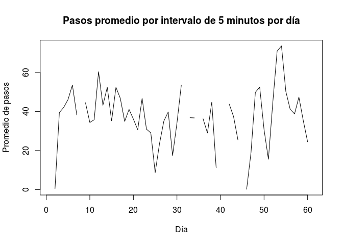
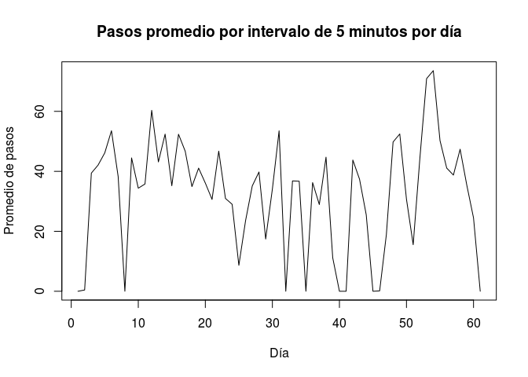

# Tarea_armando
armando  
19 de marzo de 2016  
##Tarea_1_ADV##

**1. Introducción**

Existen dispositivos como Fitbit o Nike Fuelband para monitorear la actividad diaria de una persona como por ejemplo un conteo del número de pasos. En este ejercicio se va analizar el registro de uno de estos dispositivos que llevaba determinada persona durante los meses de octubre y noviembre del año 2012. El dispositivo registraba el conteo de pasos cada cinco minutos.


**2. Sección donde se pre-procesen y se carguen los datos**

Lo primero que se hizo fue definir nuestro espacio de trabajo con el siguiente path:


```r
setwd("/home/armando/Documentos/Clase_Rstudio/Tarea_armando")
```

A continuación, se lee el archivo de datos para observar qué tipo de información se manejará. En este caso es un archivo con datos en columnas (número de pasos, fecha e intervalo de tiempo cada 5 minutos). 


```r
datos=read.csv("activity.csv",header=T, sep=",")
x=datos
head(x)
```

```
##   steps       date interval
## 1    NA 2012-10-01        0
## 2    NA 2012-10-01        5
## 3    NA 2012-10-01       10
## 4    NA 2012-10-01       15
## 5    NA 2012-10-01       20
## 6    NA 2012-10-01       25
```


**3. Reportar la media y mediana del numero de pasos tomados por dia**

Debido a que en el pre-proceso de datos se observó que existen dias con datos faltantes (NA), para poder obtener la media y la mediana con los datos disponibles fue necesario ignorar esos datos. 


```r
mean(x$steps, na.rm=TRUE)
```

```
## [1] 37.3826
```

```r
median(x$steps, na.rm = TRUE)
```

```
## [1] 0
```

Como parte del análisis también se creo una tabla en la cual se muestran las medias y medianas de los intervalos de 5 minutos por día. En  este caso para efectos de continuidad en el calendario, sí se incluyen los días en los que no hay datos y se anotan como (NA).


```r
date=levels(datos$date)
for(i in 1:length(date))
{
  aux=which(datos$date==date[i])
  steps_day=datos$steps[aux]
  mean_day=mean(steps_day,na.rm=TRUE)
  median_day=median(steps_day,na.rm=TRUE) 
  
  write.table(data.frame(date[i],mean_day,median_day),    file="result1.txt",append=T,sep="\t",row.names=F,quote=F,col.names=F)
}

z=read.table(file="result1.txt")
names(z)=c("date","mean","median")
z
```

```
##          date       mean median
## 1  2012-10-01         NA     NA
## 2  2012-10-02  0.4375000      0
## 3  2012-10-03 39.4166667      0
## 4  2012-10-04 42.0694444      0
## 5  2012-10-05 46.1597222      0
## 6  2012-10-06 53.5416667      0
## 7  2012-10-07 38.2465278      0
## 8  2012-10-08         NA     NA
## 9  2012-10-09 44.4826389      0
## 10 2012-10-10 34.3750000      0
## 11 2012-10-11 35.7777778      0
## 12 2012-10-12 60.3541667      0
## 13 2012-10-13 43.1458333      0
## 14 2012-10-14 52.4236111      0
## 15 2012-10-15 35.2048611      0
## 16 2012-10-16 52.3750000      0
## 17 2012-10-17 46.7083333      0
## 18 2012-10-18 34.9166667      0
## 19 2012-10-19 41.0729167      0
## 20 2012-10-20 36.0937500      0
## 21 2012-10-21 30.6284722      0
## 22 2012-10-22 46.7361111      0
## 23 2012-10-23 30.9652778      0
## 24 2012-10-24 29.0104167      0
## 25 2012-10-25  8.6527778      0
## 26 2012-10-26 23.5347222      0
## 27 2012-10-27 35.1354167      0
## 28 2012-10-28 39.7847222      0
## 29 2012-10-29 17.4236111      0
## 30 2012-10-30 34.0937500      0
## 31 2012-10-31 53.5208333      0
## 32 2012-11-01         NA     NA
## 33 2012-11-02 36.8055556      0
## 34 2012-11-03 36.7048611      0
## 35 2012-11-04         NA     NA
## 36 2012-11-05 36.2465278      0
## 37 2012-11-06 28.9375000      0
## 38 2012-11-07 44.7326389      0
## 39 2012-11-08 11.1770833      0
## 40 2012-11-09         NA     NA
## 41 2012-11-10         NA     NA
## 42 2012-11-11 43.7777778      0
## 43 2012-11-12 37.3784722      0
## 44 2012-11-13 25.4722222      0
## 45 2012-11-14         NA     NA
## 46 2012-11-15  0.1423611      0
## 47 2012-11-16 18.8923611      0
## 48 2012-11-17 49.7881944      0
## 49 2012-11-18 52.4652778      0
## 50 2012-11-19 30.6979167      0
## 51 2012-11-20 15.5277778      0
## 52 2012-11-21 44.3993056      0
## 53 2012-11-22 70.9270833      0
## 54 2012-11-23 73.5902778      0
## 55 2012-11-24 50.2708333      0
## 56 2012-11-25 41.0902778      0
## 57 2012-11-26 38.7569444      0
## 58 2012-11-27 47.3819444      0
## 59 2012-11-28 35.3576389      0
## 60 2012-11-29 24.4687500      0
## 61 2012-11-30         NA     NA
```

**4. Incluir una gráfica que permita visualizar los patrones de actividad diaria**

Para hacer la gráfica de los patrones por día, se usaron los datos generados y guardados en la tabla anterior. Notese que los días en los cuales no existen datos (8 en total) los espaciós de la gráfica están vacios.


```r
plot(z$mean,type="l", main="Pasos promedio por intervalo de 5 minutos por día",xlab="Día",ylab = "Promedio de pasos")
```



**5. Comparar los valores de actividad (numero de pasos) en los fines de semana contra el resto de la semana.**

Para poder hacer esto, primero se obtuvieron los días de la semana correspondientes a cada fecha registrada. Se obtuvieron las medias de los días correspondientes a los fines de semana (sabado(sab) y domingo (dom). 


```r
days <-format(as.Date(datos[,2]),format="%a")
mean(datos[days=="dom"|days=="sab",1],na.rm=TRUE)
```

```
## [1] 42.63095
```

Y para poder hacer la comparación, se calcularon las medias para el resto de los días de la semana.


```r
mean(datos[!(days=="dom"|days=="sab"),1],na.rm=TRUE)
```

```
## [1] 36.58394
```

**6. Proponer una manera de reemplazar los NAs con valores (basados en los datos que se tienen) y reemplazarlos.**

Para poder hacer un análisis adecuado de los datos es necesario darle valor numérico a los registros sin información disponible (NA) por lo cual se propone asignarles valor de cero (0).

Datos crudos:


```r
datosq<-read.csv("activity.csv",header=TRUE,sep=",")
head (datosq)
```

```
##   steps       date interval
## 1    NA 2012-10-01        0
## 2    NA 2012-10-01        5
## 3    NA 2012-10-01       10
## 4    NA 2012-10-01       15
## 5    NA 2012-10-01       20
## 6    NA 2012-10-01       25
```


Asignación de valor numérico a los NAs y asignación del día de la semana correspondiente a cada fecha.


```r
datosq[is.na(datosq)] <- 0
x=datosq
x$date=as.Date(x$date)
x$date=format(x$date , format= "%a %m" )
head(x)
```

```
##   steps   date interval
## 1     0 lun 10        0
## 2     0 lun 10        5
## 3     0 lun 10       10
## 4     0 lun 10       15
## 5     0 lun 10       20
## 6     0 lun 10       25
```


**7. Volver a calcular los pasos 2,3 y 4 con los valores reemplazados**

**Reportar media**


```r
mean(x$steps, na.rm=TRUE)
```

```
## [1] 32.47996
```

**Reportar mediana**


```r
median(x$steps, na.rm = TRUE)
```

```
## [1] 0
```

**Graficar los patrones de actividad diaria**

Primero se crea la tabla con los promedios de las lecturas diarias (cada 5 minutos).


```r
date=levels(datosq$date)
for(i in 1:length(date))
{
  aux=which(datosq$date==date[i])
  steps_day=datosq$steps[aux]
  mean_day=mean(steps_day,na.rm=TRUE)
  median_day=median(steps_day,na.rm=TRUE) 
  
  write.table(data.frame(date[i],mean_day,median_day),    file="result2.txt",append=T,sep="\t",row.names=F,quote=F,col.names=F)
}

z=read.table(file="result2.txt")
names(z)=c("date","mean","median")
z
```

```
##          date       mean median
## 1  2012-10-01  0.0000000      0
## 2  2012-10-02  0.4375000      0
## 3  2012-10-03 39.4166667      0
## 4  2012-10-04 42.0694444      0
## 5  2012-10-05 46.1597222      0
## 6  2012-10-06 53.5416667      0
## 7  2012-10-07 38.2465278      0
## 8  2012-10-08  0.0000000      0
## 9  2012-10-09 44.4826389      0
## 10 2012-10-10 34.3750000      0
## 11 2012-10-11 35.7777778      0
## 12 2012-10-12 60.3541667      0
## 13 2012-10-13 43.1458333      0
## 14 2012-10-14 52.4236111      0
## 15 2012-10-15 35.2048611      0
## 16 2012-10-16 52.3750000      0
## 17 2012-10-17 46.7083333      0
## 18 2012-10-18 34.9166667      0
## 19 2012-10-19 41.0729167      0
## 20 2012-10-20 36.0937500      0
## 21 2012-10-21 30.6284722      0
## 22 2012-10-22 46.7361111      0
## 23 2012-10-23 30.9652778      0
## 24 2012-10-24 29.0104167      0
## 25 2012-10-25  8.6527778      0
## 26 2012-10-26 23.5347222      0
## 27 2012-10-27 35.1354167      0
## 28 2012-10-28 39.7847222      0
## 29 2012-10-29 17.4236111      0
## 30 2012-10-30 34.0937500      0
## 31 2012-10-31 53.5208333      0
## 32 2012-11-01  0.0000000      0
## 33 2012-11-02 36.8055556      0
## 34 2012-11-03 36.7048611      0
## 35 2012-11-04  0.0000000      0
## 36 2012-11-05 36.2465278      0
## 37 2012-11-06 28.9375000      0
## 38 2012-11-07 44.7326389      0
## 39 2012-11-08 11.1770833      0
## 40 2012-11-09  0.0000000      0
## 41 2012-11-10  0.0000000      0
## 42 2012-11-11 43.7777778      0
## 43 2012-11-12 37.3784722      0
## 44 2012-11-13 25.4722222      0
## 45 2012-11-14  0.0000000      0
## 46 2012-11-15  0.1423611      0
## 47 2012-11-16 18.8923611      0
## 48 2012-11-17 49.7881944      0
## 49 2012-11-18 52.4652778      0
## 50 2012-11-19 30.6979167      0
## 51 2012-11-20 15.5277778      0
## 52 2012-11-21 44.3993056      0
## 53 2012-11-22 70.9270833      0
## 54 2012-11-23 73.5902778      0
## 55 2012-11-24 50.2708333      0
## 56 2012-11-25 41.0902778      0
## 57 2012-11-26 38.7569444      0
## 58 2012-11-27 47.3819444      0
## 59 2012-11-28 35.3576389      0
## 60 2012-11-29 24.4687500      0
## 61 2012-11-30  0.0000000      0
```

Se crea la nueva gráfica con los promedios por día. Notese que los días que no tenian datos en la gráfica anterior, ahora tienen valor "0" y la linea de la gráfica es continua.


```r
plot(z$mean,type="l", main="Pasos promedio por intervalo de 5 minutos por día",xlab="Día",ylab = "Promedio de pasos")
```



**8. Discusión y conclusiones**

Los resultados analizados mostraron que la persona que lo llevaba consigo tiene una mayor actividad durante los fines de semana, tal vez debido a que usa esos días de descanso para ejercitarse ya sea caminando o corriendo. Aunque en los días 53 y 54 tuvo un aumento considerable en su numero de pasos. Sin embargo, tambien se observaron varios días en los cuales había registros de cero actividad o sin registro de actividad, lo cual podría indicar que esta persona no llevaba el aparato consigo o que estaba apagado. Sería bueno hacer un análisis más completo, por ejemplo donde se obtenga el número de pasos por hora, así se podría inferir no sólo sobré qué días es más activo sino también en qué horarios del día.

